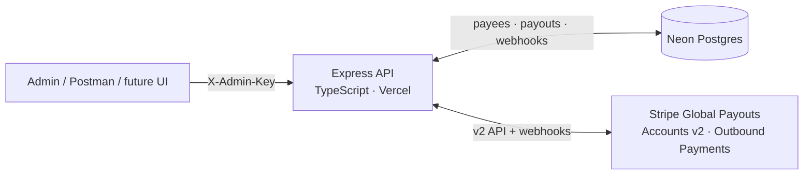
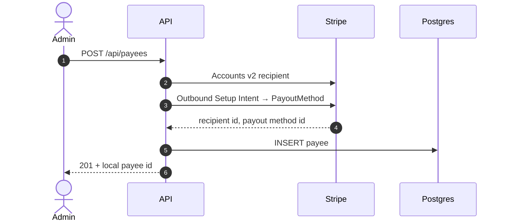
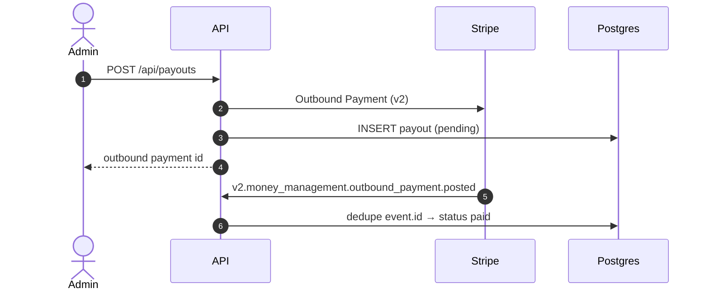

# stripe-global-payout

**Pay international freelancers from a US platform without Stripe Connect accounts.**

Production-style API for [Stripe Global Payouts](https://docs.stripe.com/global-payouts): freelancers stay on your product, you store bank details as **recipients** + **payout methods**, and money leaves via **Outbound Payments** (v2). Built with **Node.js, TypeScript, Express, Neon Postgres**, deployable on **Vercel**.

> Portfolio project demonstrating Stripe preview APIs, webhook idempotency, and the Global Payouts vs Connect architecture choice.

<!-- chunhuduc.com:showcase:start -->
```yaml
summary: "Production-style API for Stripe Global Payouts: stores freelancer bank details as recipients and payout methods, moves money via Outbound Payments (v2), with idempotent webhook processing and a country-rail registry."
tags: [Stripe, Node.js, TypeScript, Express, Neon, Webhooks]
demoUrl: https://aaron-stripe-payout-api.vercel.app
outcome: "Pays international freelancers without onboarding them as Stripe Connect accounts."
complexityScore: 5
motif: { from: "#16a34a", to: "#65a30d", icon: automation }
architecture:
  from: "#16a34a"
  to: "#65a30d"
  nodes:
    - { id: admin, label: "Admin client", x: 18, y: 14 }
    - { id: api, label: "Express API", x: 50, y: 14, kind: primary }
    - { id: db, label: "Neon Postgres", x: 50, y: 50, kind: store }
    - { id: stripe, label: "Stripe Global Payouts", x: 82, y: 30 }
    - { id: webhook, label: "Webhook + dedupe", x: 18, y: 50 }
  edges:
    - { from: admin, to: api, flow: true }
    - { from: api, to: db, flow: true }
    - { from: api, to: stripe, flow: true }
    - { from: stripe, to: webhook, flow: true, curve: -4 }
    - { from: webhook, to: db, curve: 4 }
```
<!-- chunhuduc.com:showcase:end -->

---

## The problem

Marketplaces and platforms often need to pay contractors in **Jordan, Turkey, Indonesia**, and similar corridors. Two common mistakes:

| Approach | Why it breaks |
| -------- | ------------- |
| **Stripe Connect** connected accounts | Many corridors cannot be Connect account holders. Adds onboarding friction. |
| **Platform `payouts.create` to many banks** | Platform external accounts are for *your* banks, not arbitrary freelancer IBANs. |

**Global Payouts** is the intended model: one US platform account, many **recipients**, outbound money movement with country-specific bank rails.

---

## Architecture



### Payee onboarding



### Payout and async status



---

## Technical highlights

- **Dual Stripe clients:** Node SDK (v1) for webhook signatures, custom `fetch` client for Global Payouts **preview API** (`Stripe-Version` header, `Stripe-Context` on setup intents).
- **Thin v2 webhooks:** Handles `v2.money_management.outbound_payment.*` payloads via `related_object.id`, not classic `event.data.object`.
- **Idempotent webhooks:** `stripe_webhook_events.event_id` primary key prevents double-processing retries.
- **Raw body ordering:** `/webhooks` registered before `express.json()` so signatures verify correctly on Vercel.
- **Country registry:** Extensible config (`JO` wire today, TR/ID planned). See `apps/api/src/config/countries/`.
- **Serverless-ready:** Single Express app exported from `api/index.ts` with compiled `apps/api/dist`.

---

## Stack

| Layer | Choice |
| ----- | ------ |
| Runtime | Node.js 20+, TypeScript |
| HTTP | Express 4 |
| Database | Neon serverless Postgres |
| Payments | Stripe Global Payouts (Accounts v2, Outbound Payments) |
| Deploy | Vercel serverless |
| Testing | Postman collection included |

---

## API

| Method | Path | Auth | Description |
| ------ | ---- | ---- | ----------- |
| GET | `/health` | — | Liveness |
| POST | `/api/payees` | `X-Admin-Key` | Create recipient + wire payout method |
| POST | `/api/payouts` | `X-Admin-Key` | Outbound payment to saved payee |
| GET | `/api/payouts/:id` | `X-Admin-Key` | Payout status |
| POST | `/webhooks/stripe` | Stripe signature | v2 outbound payment lifecycle |

Postman: [`postman/global-payouts-api.json`](postman/global-payouts-api.json)

---

## Quick start

Requires a Stripe **sandbox** with **Global Payouts** enabled ([docs/GLOBAL-PAYOUTS-SANDBOX.md](docs/GLOBAL-PAYOUTS-SANDBOX.md)).

```bash
git clone https://github.com/chunhuduc/stripe-global-payout.git
cd stripe-global-payout
cp .env.example .env.local   # STRIPE_SECRET_KEY, DATABASE_URL, ADMIN_API_KEY, STRIPE_WEBHOOK_SECRET
npm install
npm run migrate
npm run dev
```

Webhooks (second terminal):

```bash
stripe listen --forward-to localhost:3000/webhooks/stripe
```

Copy the CLI `whsec_...` into `.env.local`, restart the API, then import the Postman collection.

Full walkthrough: [docs/GETTING-STARTED.md](docs/GETTING-STARTED.md) · [docs/TESTING.md](docs/TESTING.md)

---

## Documentation

| Doc | Contents |
| --- | -------- |
| [docs/README.md](docs/README.md) | Index |
| [docs/GETTING-STARTED.md](docs/GETTING-STARTED.md) | Environment and first run |
| [docs/GLOBAL-PAYOUTS-SANDBOX.md](docs/GLOBAL-PAYOUTS-SANDBOX.md) | Sandbox setup and test bank data |
| [docs/WEBHOOKS.md](docs/WEBHOOKS.md) | Event types and deduplication |
| [docs/CODEMAP.md](docs/CODEMAP.md) | Source layout |
| [docs/DEPLOY.md](docs/DEPLOY.md) | Vercel + Neon |
| [docs/ROADMAP.md](docs/ROADMAP.md) | Delivered scope and next steps |

Deep dive (same diagrams expanded): [docs/ARCHITECTURE.md](docs/ARCHITECTURE.md)

---

## Roadmap

**Shipped:** Jordan wire recipients, outbound payments, v2 webhooks, migrations, Postman, docs.

**Next:** Admin UI (`apps/web`), Turkey and Indonesia country modules, retry flows, reporting dashboard.

---

## License

MIT (or specify your license). Stripe API usage subject to [Stripe Terms](https://stripe.com/legal).
