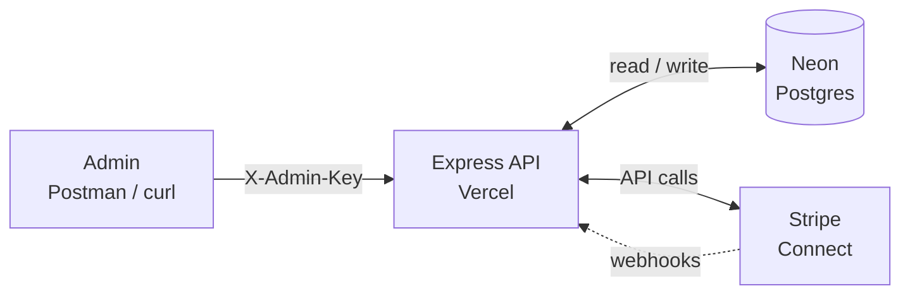
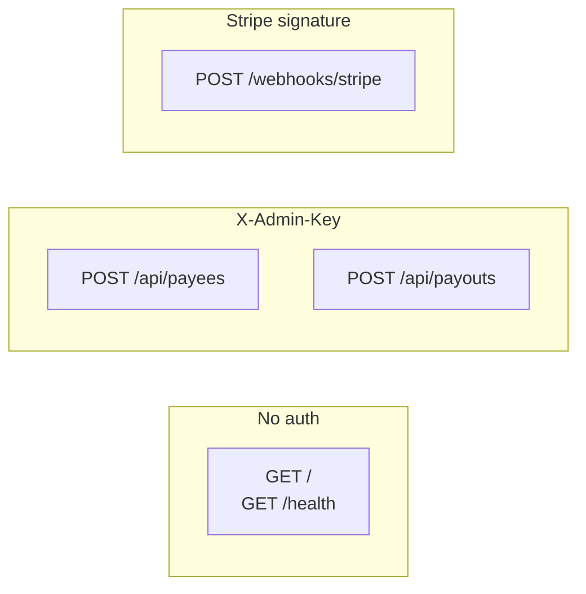
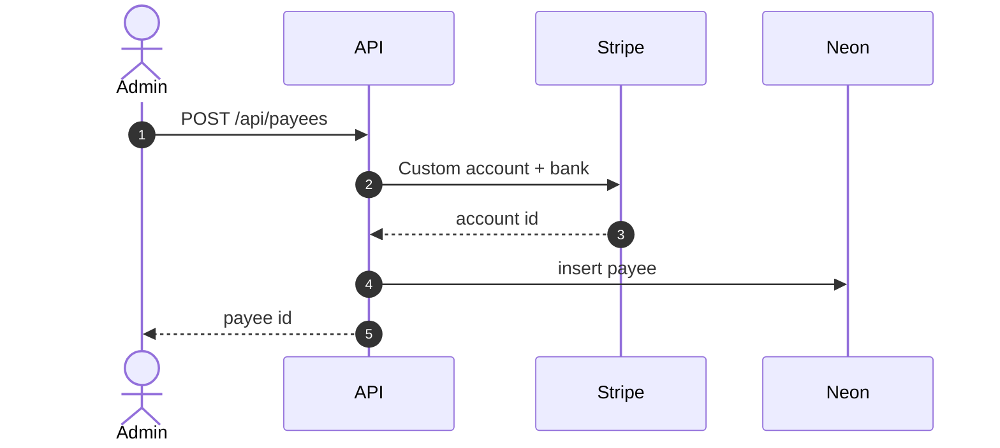
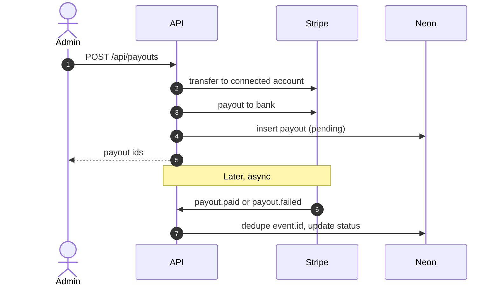

# Architecture

## Overview

Production API: `https://aaron-stripe-payout-api.vercel.app`

### System map

Left to right: who calls the API, what it talks to, how Stripe calls back.

| Piece | Role |
| ----- | ---- |
| Admin | Creates payees and starts payouts (no Stripe login for payees) |
| Express API | `apps/api`, entry `api/index.ts` on Vercel |
| Neon | `payees`, `payouts`, `stripe_webhook_events` |
| Stripe | Custom accounts, transfer, payout, webhook events |

### API routes (phase 1)

### Flow A: Create payee

### Flow B: Payout + status

## Runtime

- **Production:** Vercel Hobby (free tier), single Express app exported from `api/index.ts`.
- **Database:** Neon serverless Postgres (`@neondatabase/serverless` Pool), pooled `DATABASE_URL` on Vercel.
- **Local:** `npm run dev` listens on `PORT`; same code path via `createApp()`.

## Components

### API (`apps/api`)

- **Express** app factory in `src/app.ts`; routes: health, payees, payouts, webhooks.
- **Middleware:** `requireAdmin` checks `X-Admin-Key` against `ADMIN_API_KEY`.
- **Webhooks:** `/webhooks` router registered before `express.json()` for Stripe raw body verification.

### Data (Neon Postgres)

- **payees**: local id, country, Stripe connected account id, email, status.
- **payouts**: payee link, Stripe transfer/payout ids, amount, currency, status, failure fields.
- **stripe_webhook_events**: primary key on Stripe `event.id` for idempotent processing.

### Stripe

- **Payees:** Connect **Custom** accounts + external bank (Jordan: IBAN + SWIFT in M1).
- **Payout flow:** transfer to connected account, then payout on connected account.
- **Webhooks:** `payout.paid` and `payout.failed` update `payouts` by `stripe_payout_id`.

### Shared (`packages/shared`)

Shared TypeScript types consumed by the API.

## Configuration

- Country modules under `src/config/countries/` (M1: Jordan `JO`).
- Env validation in `src/config/env.ts` (dotenv only outside production).

## Security notes (M1)

- Shared admin API key (set strong value in Vercel env).
- Webhook signing secret required.
- No payee-facing auth in M1.
