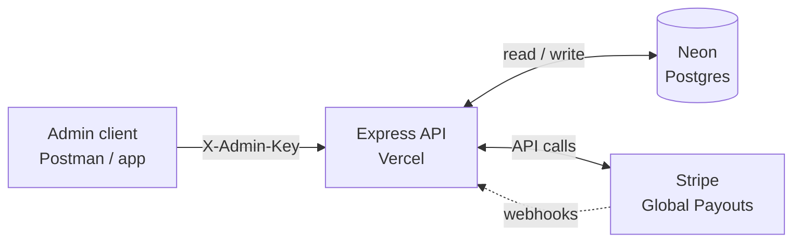
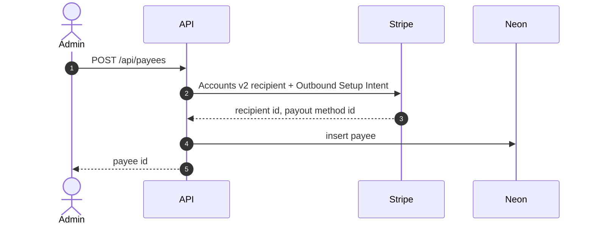
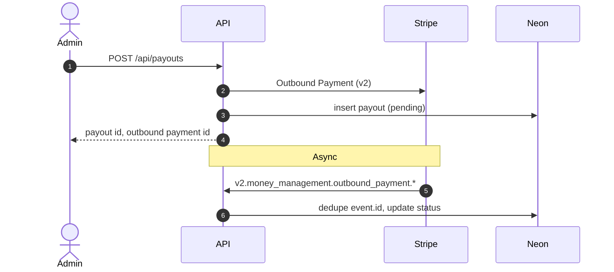

# Architecture

## Overview

Express API (Vercel serverless) + Neon Postgres + **Stripe Global Payouts** (Accounts v2 recipients, Outbound Payments, v2 webhooks).

| Component | Role |
| --------- | ---- |
| Admin client | Creates payees and initiates payouts (freelancers do not log into Stripe) |
| Express API | `apps/api`, Vercel entry `api/index.ts` |
| Neon | `payees`, `payouts`, `stripe_webhook_events` |
| Stripe | Recipients, payout methods, outbound payments, webhook events |

## API routes

| Auth | Routes |
| ---- | ------ |
| None | `GET /`, `GET /health` |
| `X-Admin-Key` | `POST /api/payees`, `POST /api/payouts`, `GET /api/payouts/:id` |
| Stripe signature | `POST /webhooks/stripe` |

## Flow: Create payee

## Flow: Outbound payment + status

## Runtime

- **Production:** Vercel (Express app from `api/index.ts`).
- **Database:** Neon serverless Postgres (`DATABASE_URL` pooled on Vercel).
- **Local:** `npm run dev` on `PORT` (default 3000).

## Data model

### `payees`

- Local UUID, `country_code`, `email`, `status`
- `stripe_recipient_id`, `stripe_payout_method_id` (Global Payouts)

### `payouts`

- Amount, currency, `status`, optional failure fields
- `stripe_outbound_payment_id` (primary for new payouts)
- Legacy nullable columns `stripe_transfer_id`, `stripe_payout_id` for older rows

### `stripe_webhook_events`

- Primary key: Stripe `event.id` (idempotent webhook processing)

## Stripe integration

| Concern | Implementation |
| ------- | -------------- |
| Payee onboarding | `apps/api/src/stripe/recipients.ts` (Accounts v2 + Outbound Setup Intent) |
| Payout | `apps/api/src/stripe/outboundPayments.ts` |
| v2 HTTP client | `apps/api/src/stripe/v2Client.ts` (preview API version header) |
| Webhooks | `apps/api/src/services/webhookService.ts` |

**Not used for new payees:** Stripe Connect Custom accounts, `transfers.create`, connected-account `payouts.create`.

Legacy Connect webhook handlers remain for existing database rows only.

## Configuration

- Country modules: `apps/api/src/config/countries/` (Jordan enabled in phase 1).
- Environment: `apps/api/src/config/env.ts` (loads `.env.local` locally).

## Security

- Admin routes: shared secret `ADMIN_API_KEY` via `X-Admin-Key`.
- Webhooks: `Stripe-Signature` verified with `STRIPE_WEBHOOK_SECRET`.
- Raw body on `/webhooks/stripe` (registered before `express.json()`).
